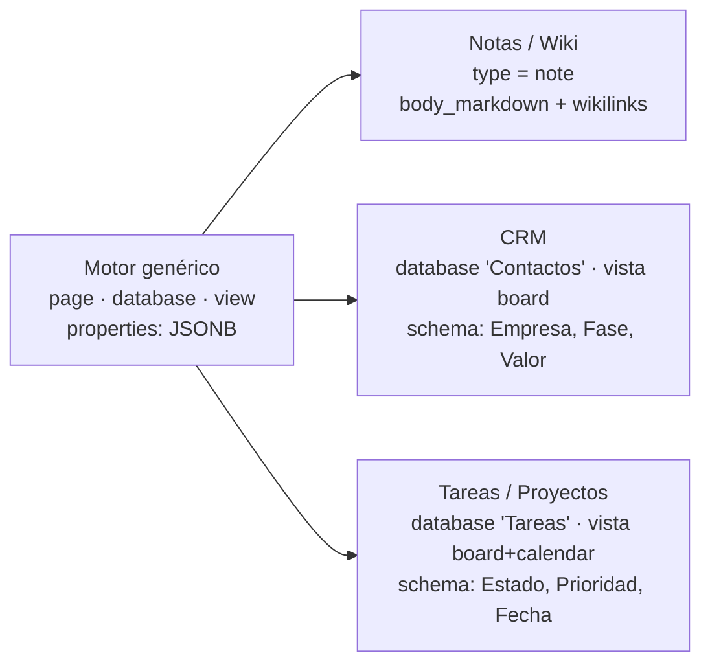
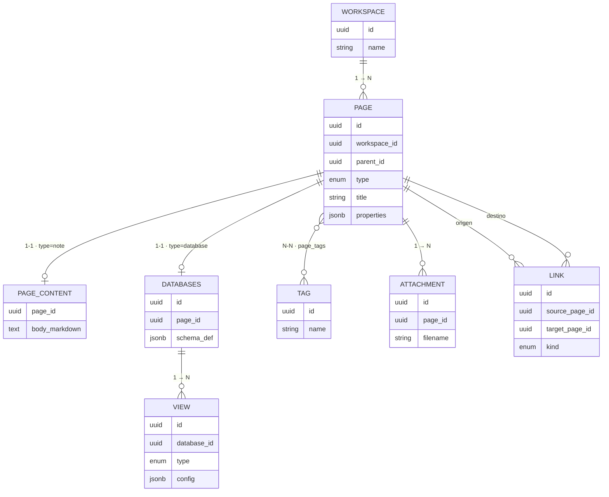
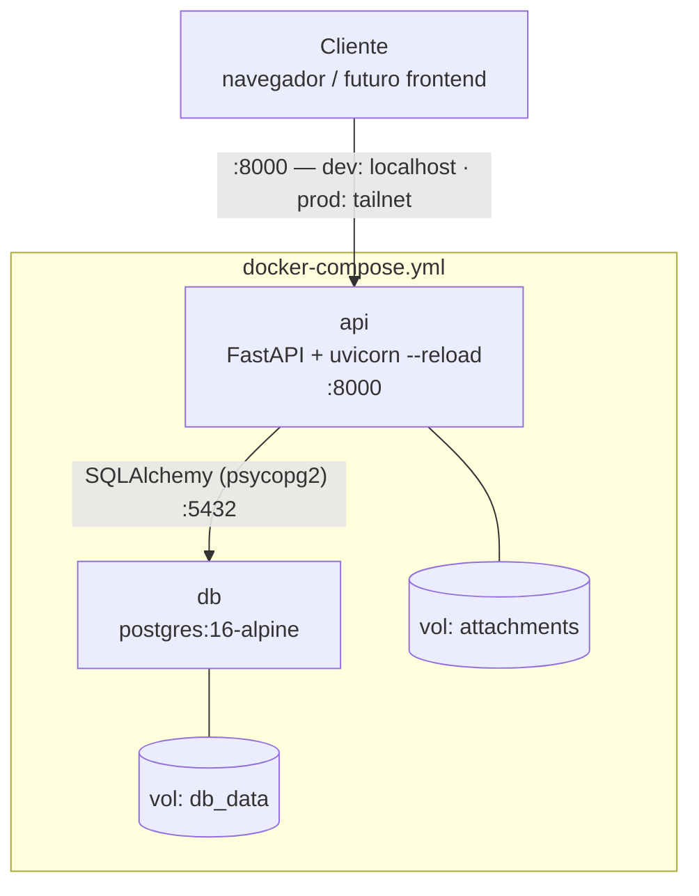
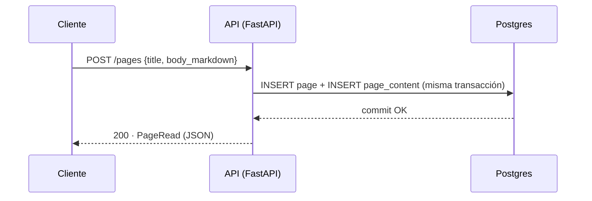
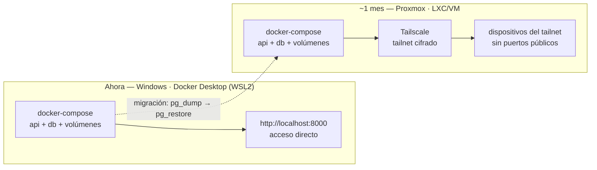
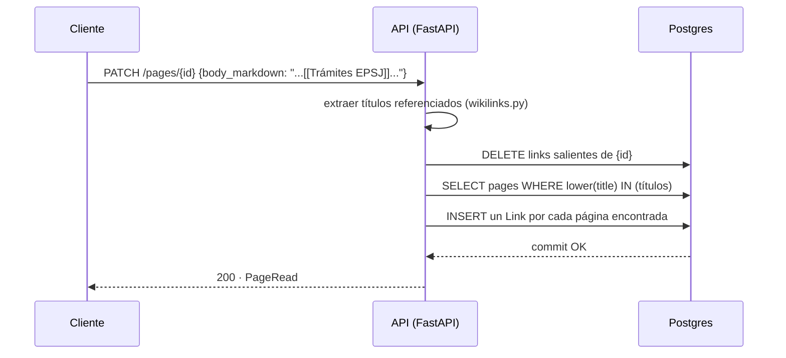
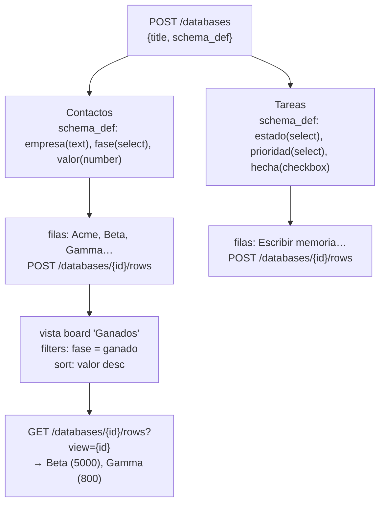

# Arquitectura

## 1. Un motor, tres productos

`CRM` y `Tareas/Proyectos` no tienen tablas propias: son instancias de `database` con un `schema_def` concreto y una vista `board` encima. Las notas son el caso más simple — una `page` con `type = note` y cuerpo en Markdown. Las tres viven en la misma tabla `pages`.

## 2. Modelo de datos

`page` es la entidad bisagra: según su `type` se resuelve contra `page_content` (nota) o contra `databases` (fila de una base de datos). Vistas, enlaces, etiquetas y adjuntos cuelgan de ahí.

## 3. Arquitectura de contenedores

Dos servicios en `docker-compose.yml`: `api` (FastAPI + Uvicorn) y `db` (Postgres). El bind-mount de `./backend/app` solo existe en desarrollo, para recarga en caliente.

## 4. Flujo de una petición: `POST /pages`

El caso ya implementado y probado. Todo en una única transacción — `page` y `page_content` se confirman juntas o ninguna.

## 5. Desarrollo (Windows) → Producción (Proxmox)

El stack de contenedores no cambia entre entornos — solo cómo se llega a él.

## 6. Wikilinks: de texto a backlink

Los wikilinks se resuelven **al guardar**, no al leer — el cuerpo se escanea, se buscan páginas cuyo título coincida (sin distinguir mayúsculas) y se recalculan los `Link` salientes de esa página desde cero cada vez.

Limitación conocida: renombrar una página no repara los wikilinks que otras páginas ya guardaron apuntando al título antiguo — se corrigen la próxima vez que esa página de origen se vuelva a guardar.

## 7. El motor de `database` + `view`, probado con dos dominios reales

Esto es lo que hace innecesario tener código de "CRM" o de "Tareas": el mismo endpoint genérico, con dos `schema_def` distintos, produce dos productos distintos.

`properties.py` valida cada fila contra el `schema_def` de su database al guardar (claves conocidas, tipo básico, opciones de `select`) — sin eso, un CRM y un gestor de tareas comparten tabla sin ninguna garantía de forma, y los errores se descubrirían leyendo, no escribiendo.

## Decisiones y por qué

| Decisión | Elegido | Por qué |
| --- | --- | --- |
| Storage de notas | Postgres, no archivos `.md` | Elimina el problema de sincronizar archivos entre dispositivos — un único servidor es la fuente de verdad |
| Propiedades de `database` | JSONB flexible | Añadir un campo nuevo no requiere migración de esquema |
| Migraciones | Alembic desde Fase 1 | `create_all()` sirvió para iterar rápido en Fase 0; Alembic entra ahora que el modelo tiene datos reales que preservar. La FK circular `pages` ↔ `databases` rompe el autogenerate por defecto — ver comentario en la migración inicial |
| Resolución de wikilinks | Por título, al guardar (no al leer) | Guardar es poco frecuente, leer es constante — recalcular en cada lectura sería más caro sin necesidad |
| Búsqueda | Postgres `tsvector`/`tsquery` (`spanish`) | A esta escala (1 usuario) no justifica una pieza aparte tipo Meilisearch; se puede migrar si hace falta |
| Validación de `properties` | Ligera (claves + tipo básico), no estricta | Coherente con "JSONB flexible": atrapa errores obvios (typos, opciones inválidas) sin forzar campos obligatorios ni bloquear la iteración del schema |
| Filtro/orden de vistas | En Python sobre filas ya cargadas, no SQL dinámico sobre JSONB | A esta escala (una persona, cientos de filas como mucho) es más simple y igual de rápido que construir predicados SQL contra JSONB; se puede mover a SQL si el volumen lo justifica |
| Acceso remoto | Tailscale, sin auth propia (aún) | Uso personal en solitario; `user_id`/`workspace_id` ya están en el esquema para añadir auth real sin rediseñar |
| API | REST | Un solo tipo de cliente, sin problema real de over/under-fetching a esta escala |
