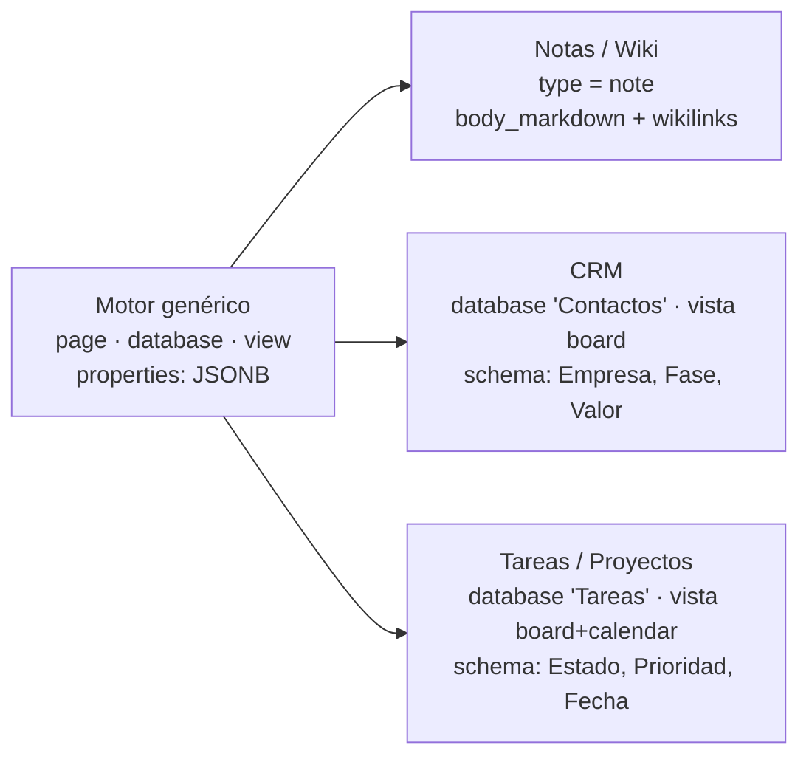
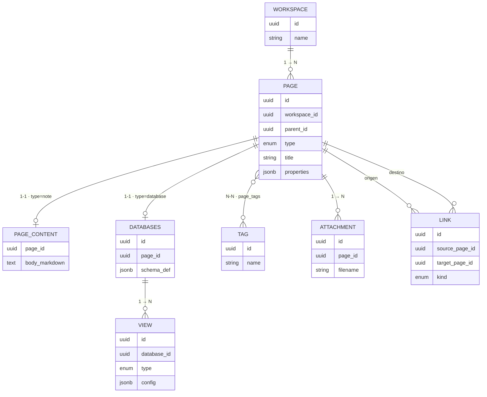
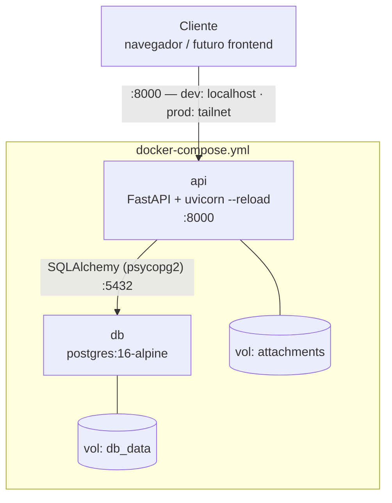
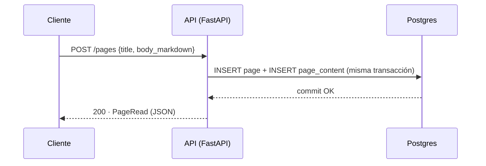
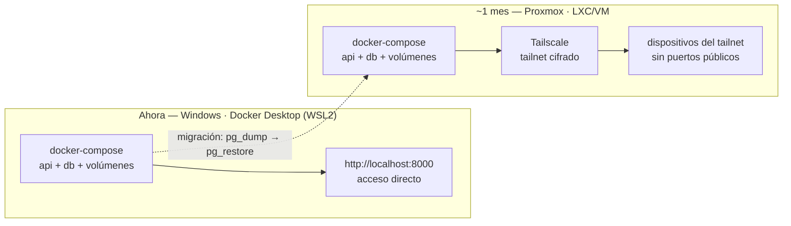
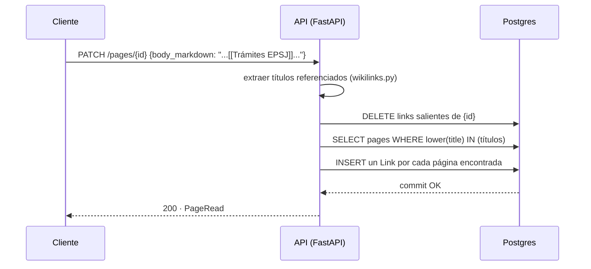
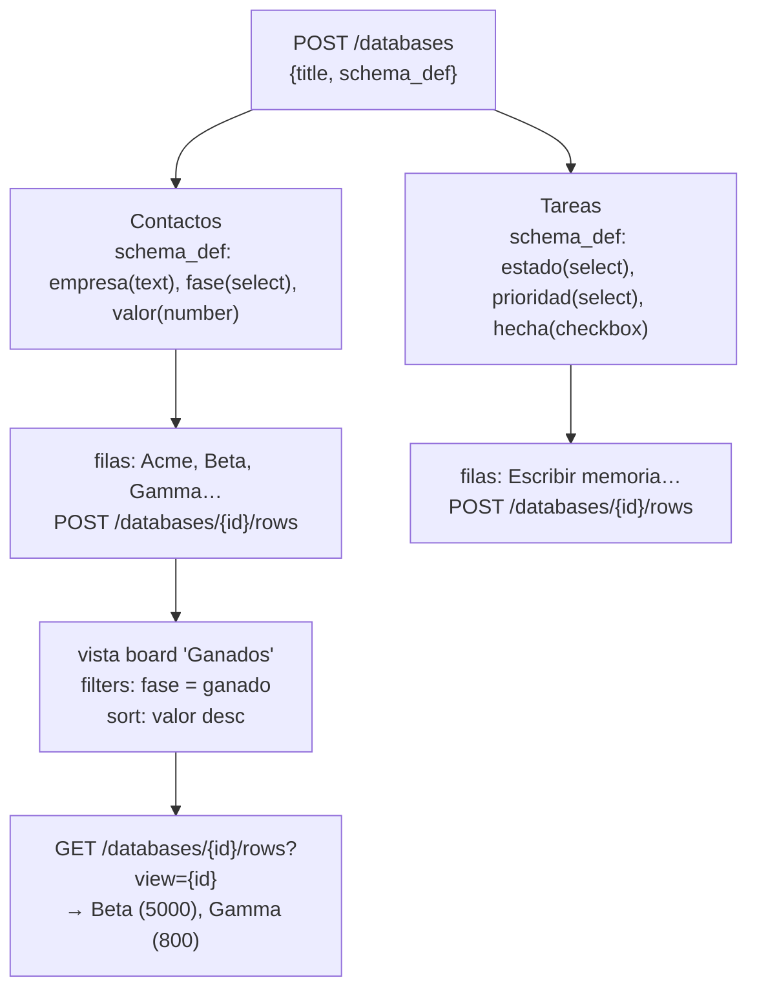
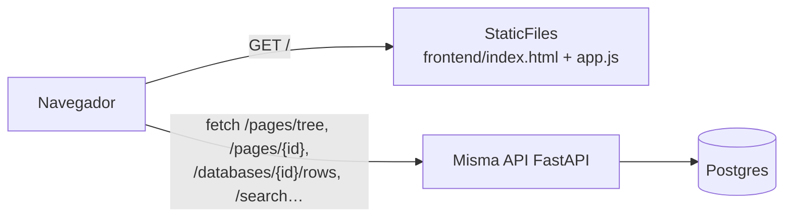
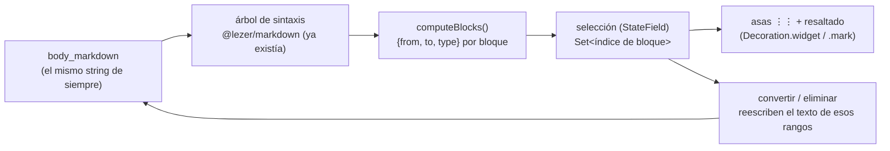

# Arquitectura

## 1. Un motor, tres productos

`CRM` y `Tareas/Proyectos` no tienen tablas propias: son instancias de `database` con un `schema_def` concreto y una vista `board` encima. Las notas son el caso más simple — una `page` con `type = note` y cuerpo en Markdown. Las tres viven en la misma tabla `pages`.



## 2. Modelo de datos

`page` es la entidad bisagra: según su `type` se resuelve contra `page_content` (nota) o contra `databases` (fila de una base de datos). Vistas, enlaces, etiquetas y adjuntos cuelgan de ahí.



## 3. Arquitectura de contenedores

Dos servicios en `docker-compose.yml`: `api` (FastAPI + Uvicorn) y `db` (Postgres). Los bind-mounts (`./backend/app`, `./frontend`...) solo existen en desarrollo, para recarga en caliente sin reconstruir la imagen.

La imagen de `api` es autocontenida: su build usa como contexto la raíz del repo (no `./backend`) para poder copiar `frontend/` dentro además del propio backend. No siempre fue así -- al principio el Dockerfile solo copiaba `backend/`, y `frontend/` llegaba exclusivamente vía el bind-mount de desarrollo; fuera de esta máquina (sin ese bind-mount) `/app/frontend` se creaba vacío y el panel no se servía. Como los bind-mounts de desarrollo se superponen a lo que ya trae la imagen, arreglar esto no cambió nada del flujo de trabajo en Windows -- solo hizo que la misma imagen funcione también sin ellos.



## 4. Flujo de una petición: `POST /pages`

El caso ya implementado y probado. Todo en una única transacción — `page` y `page_content` se confirman juntas o ninguna.



## 5. Desarrollo (Windows) → Producción (Proxmox)

El stack de contenedores no cambia entre entornos — solo cómo se llega a él.



## 6. Wikilinks: de texto a backlink

Los wikilinks se resuelven **al guardar**, no al leer — el cuerpo se escanea, se buscan páginas cuyo título coincida (sin distinguir mayúsculas) y se recalculan los `Link` salientes de esa página desde cero cada vez.



Limitación conocida: renombrar una página no repara los wikilinks que otras páginas ya guardaron apuntando al título antiguo — se corrigen la próxima vez que esa página de origen se vuelva a guardar.

## 7. El motor de `database` + `view`, probado con dos dominios reales

Esto es lo que hace innecesario tener código de "CRM" o de "Tareas": el mismo endpoint genérico, con dos `schema_def` distintos, produce dos productos distintos.



`properties.py` valida cada fila contra el `schema_def` de su database al guardar (claves conocidas, tipo básico, opciones de `select`) — sin eso, un CRM y un gestor de tareas comparten tabla sin ninguna garantía de forma, y los errores se descubrirían leyendo, no escribiendo.

### Fase 3: las plantillas son datos, no motor nuevo

`POST /databases/from-template` no añade capacidades al motor — llama exactamente a lo mismo que `POST /databases` + `POST /databases/{id}/views`, varias veces, con el `schema_def` y las `views` que trae `backend/app/templates.py` en vez de escritos a mano. Si en algún momento hiciera falta lógica propia para "crear un CRM" que no fuera reducible a datos sobre el motor genérico, sería la señal de que el motor no es tan genérico como parece.

## 8. Panel visual: cliente puro sobre la misma API

`frontend/` no es una app aparte con su propio backend — es HTML/CSS/JS servido como archivos estáticos por `api` (`StaticFiles`, montado al final de las rutas) que llama a los mismos endpoints que se probaron por `curl`. No hay build, no hay framework, no hay estado en el servidor propio del frontend.



Un matiz importante: el editor resuelve `[[wikilinks]]` **en el cliente**, contra el árbol ya cargado (`state.pagesById`) — es puramente visual, para que el enlace se vea coloreado y navegable al escribir. El backlink real (`Link` en Postgres) solo existe si la página de origen se ha *guardado* después de que la página destino existiera; son dos resoluciones independientes y pueden desincronizarse temporalmente (se vio al probarlo: el editor ya mostraba el enlace resuelto antes de que `Backlinks` en la página destino pasara de 0 a 1).

Dos IDs que no son el mismo, y un bug real que salió de ahí: una `page` de `type=database` tiene su propio `id` (fila `pages`) y, por separado, el `id` de la fila `databases` que la describe (`DatabaseDef.id`). `GET /pages/tree` construye sus nodos a partir de `pages`, así que devolvía el primero — pero `GET /databases/{id}` espera el segundo. El árbol y la búsqueda navegaban con el id equivocado y cada clic sobre una base de datos fallaba con 404 sin ningún aviso visible. Se corrigió incluyendo `database_id` en cada nodo del árbol; quedó documentado aquí porque es fácil reintroducir el mismo error en cualquier endpoint nuevo que mezcle ambos ids.

### El editor: única pieza compilada del frontend

`frontend/app.js` sigue siendo JS plano sin build, pero el editor de notas es CodeMirror 6 (`frontend/editor-src/entry.js`, compilado una vez con esbuild a `frontend/vendor/editor.bundle.js`, vendorizado y commiteado). La razón por la que esto no podía ser un `<textarea>` con un panel de vista previa aparte: un `<textarea>` es texto plano uniforme, no puede tener una línea con letra grande (un `# Encabezado`) y otra con letra normal a la vez — eso exige gestión real de cursor/selección sobre contenido con formato mixto, que es exactamente lo que resuelve un editor de verdad y no una caja de texto nativa del navegador.

CodeMirror aplica clases CSS (`cm-mdm-h1`, `cm-mdm-mark`, `cm-mdm-wikilink`...) vía un `HighlightStyle` sobre el árbol de sintaxis de `@lezer/markdown`; los colores y tamaños concretos viven en el `<style>` de `index.html`, no en el bundle del editor — así el editor no sabe nada de temas claro/oscuro, solo de qué es cada cosa. Detalle no obvio: `HeaderMark`/`EmphasisMark` (los `#`/`**` en sí) llegan con **dos clases a la vez** (p. ej. `cm-mdm-h1 cm-mdm-mark`), porque heredan el tag del encabezado que los contiene Y tienen su propio tag de marcador — hace falta un selector combinado (`.cm-mdm-h1.cm-mdm-mark`) con más especificidad para que el marcador gane en tamaño sobre el encabezado. El caret usa `caret-color` en vez de la extensión `drawSelection()` de CodeMirror — no la necesitamos y así hay una capa menos.

### Autoguardado: debounce + flush, no un modelo de "documento colaborativo"

El editor no manda cada pulsación al servidor — programa un `PATCH` 2s después del último cambio (`setTimeout` que se reinicia con cada pulsación nueva). El único punto delicado es no perder ese margen de <2s cuando el usuario navega antes de que salte el temporizador: `clearMain()` (llamada al entrar en cualquier otra vista) fuerza el guardado pendiente primero, y `beforeunload` hace lo mismo al cerrar la pestaña. No hay resolución de conflictos ni bloqueo optimista — con un único usuario escribiendo, no hace falta; si esto pasa a ser multiusuario de verdad, este es el punto exacto que necesitaría revisarse.

## Edición por bloques + selección múltiple

Se pidió edición por bloques al estilo Notion (párrafo, H1–H4, listas, código, convertibles entre sí) con selección múltiple de bloques y de páginas, y menú contextual con acciones en lote. Antes de construirla se pesaron dos enfoques:

- **Bloques de verdad**: `body_markdown` deja de ser un string y pasa a ser una lista de objetos `{id, type, content}`. Es como funciona Notion por dentro. Coste: reescribir wikilinks/backlinks/búsqueda para operar sobre una lista de bloques en vez de un string, más un editor por bloque con su propia gestión de cursor.
- **Bloques calculados (el elegido)**: `body_markdown` sigue siendo un único string — nada de lo ya construido (wikilinks, backlinks, búsqueda) cambia. CodeMirror ya parsea el documento en un árbol de sintaxis que distingue párrafo/encabezado/lista/código; con eso basta para calcular, en cada momento, qué rango de texto es "un bloque".

Se implementó la segunda. `computeBlocks(state)` (`frontend/editor-src/entry.js`) recorre los hijos directos del nodo `Document` del árbol de `@lezer/markdown` y produce `{from, to, type}` por bloque — cada `ListItem` de una `BulletList`/`OrderedList` es su propio bloque (para poder seleccionarlos/convertirlos uno a uno, como en Notion), el resto de nodos de nivel superior (párrafo, encabezados, código) son un bloque cada uno.



- **Seleccionar** un bloque = seleccionar su rango de texto (CodeMirror admite selecciones múltiples no contiguas de forma nativa — `EditorSelection.create([...rangos])`).
- **Convertir** = quitar el prefijo de sintaxis actual (`stripBlockPrefix`: `## `, `- `, ```` ``` ````...) y poner el del tipo destino (`applyBlockType`), en una única transacción con un `change` por bloque.
- **Eliminar en lote** = una transacción con un `change` de borrado por bloque (más su salto de línea final, para no dejar líneas en blanco sueltas).

El coste real de este enfoque frente a "bloques de verdad": no hay reordenar por arrastre gratis (habría que construirlo aparte), y un bloque no tiene identidad propia entre una edición y la siguiente (la selección se limpia en cualquier cambio del documento — ver `blockField.update()`). Para lo pedido (seleccionar, convertir tipo, borrar en lote) cubre el 100% sin tocar nada del backend.

### El asa de cada bloque no es un gutter (lección de una vuelta atrás)

La primera versión usaba un `gutter()` de CodeMirror (como `lineNumbers()`) para mostrar el `⋮⋮` de cada bloque. No se alineaba con el contenido, y al medir de verdad (`getBoundingClientRect`, no solo mirar la pantalla) se confirmó que ni el propio `lineNumbers()` nativo alineaba bien contra un documento con encabezados: los gutters de CM6 asumen altura de línea uniforme, y un `H1` (font-size mayor) es más alto que un párrafo normal — el desfase acumulado llegaba a más de 60px en un documento con varios bloques.

La solución fue no usar un gutter en absoluto: el asa es un `Decoration.widget` colocado en la posición donde empieza el bloque, con `side: -1`, dentro de la propia línea — y sacado visualmente al margen con `position: absolute; left: -22px` sobre una línea con `position: relative`. Al ser un hijo real de esa línea concreta, hereda su altura exacta sin ningún cálculo de por medio. Con este cambio la alineación quedó exacta (0px de diferencia) en el mismo documento de prueba.

## Editor al estilo Notion: comando `/`, línea horizontal, autoformato

Tres piezas nuevas comparten un mismo patrón: **decoración consciente del cursor** (`selectionIntersects(state, from, to)` en `entry.js`). Un rango de texto se reemplaza por un widget "bonito" cuando el cursor no está dentro de él, y vuelve a mostrarse como markdown editable en crudo en cuanto el cursor entra — así el usuario nunca edita a ciegas un texto que no ve. Se usa para:

- Los wikilinks resueltos (`[[Página]]` → enlace sin corchetes, con vista previa al pasar el ratón).
- Las flechas tipográficas (`->`/`<-`/`<->` → `→`/`←`/`↔`, saltándose los bloques de código vía `isInsideCodeBlock()`).
- La línea horizontal (`---` → una regla visual).

La línea horizontal tuvo una complicación aparte: su decoración es `Decoration.replace({..., block: true})` (reemplaza la línea entera, no un tramo dentro de ella), y **CodeMirror no permite decoraciones de bloque desde un `ViewPlugin`** — solo desde un `StateField` ("Block decorations may not be specified via plugins"). El resto de decoraciones de esta sección son inline y sí pueden vivir en un `ViewPlugin`; la de la línea horizontal (`hrField`) es la excepción y por eso es un `StateField` aparte.

### El menú `/`: por qué `setTimeout(fn, 0)` y no `requestAnimationFrame`

El menú de comando necesita `view.coordsAtPos()` para posicionarse junto al cursor, pero CodeMirror prohíbe leer el layout del DOM de forma síncrona dentro de `ViewPlugin.update()` ("Reading the editor layout isn't allowed during an update") — hay que salir de esa pila primero. La solución obvia es `requestAnimationFrame`, y funciona en un navegador normal. Pero un frame de composición es más de lo que hace falta: solo hay que llegar al siguiente turno del event loop, no esperar a que el navegador pinte — y `requestAnimationFrame` nunca se dispara si la pestaña no está siendo compuesta (una pestaña en segundo plano, o el propio entorno de pruebas usado durante el desarrollo, que no compone frames a menos que algo pida explícitamente un `screenshot`). Se cambió a `setTimeout(fn, 0)`: sale de la pila igual de bien, no depende de compositing, y la app no necesita ese nivel de sincronía con el pintado — es un menú, no una animación.

## Decisiones y por qué

| Decisión | Elegido | Por qué |
| --- | --- | --- |
| Storage de notas | Postgres, no archivos `.md` | Elimina el problema de sincronizar archivos entre dispositivos — un único servidor es la fuente de verdad |
| Propiedades de `database` | JSONB flexible | Añadir un campo nuevo no requiere migración de esquema |
| Migraciones | Alembic desde Fase 1 | `create_all()` sirvió para iterar rápido en Fase 0; Alembic entra ahora que el modelo tiene datos reales que preservar. La FK circular `pages` ↔ `databases` rompe el autogenerate por defecto — ver comentario en la migración inicial |
| Resolución de wikilinks | Por título, al guardar (no al leer) | Guardar es poco frecuente, leer es constante — recalcular en cada lectura sería más caro sin necesidad |
| Búsqueda | Postgres `tsvector`/`tsquery` (`spanish`) | A esta escala (1 usuario) no justifica una pieza aparte tipo Meilisearch; se puede migrar si hace falta |
| Validación de `properties` | Ligera (claves + tipo básico), no estricta | Coherente con "JSONB flexible": atrapa errores obvios (typos, opciones inválidas) sin forzar campos obligatorios ni bloquear la iteración del schema |
| Filtro/orden de vistas | En Python sobre filas ya cargadas, no SQL dinámico sobre JSONB | A esta escala (una persona, cientos de filas como mucho) es más simple y igual de rápido que construir predicados SQL contra JSONB; se puede mover a SQL si el volumen lo justifica |
| Acceso remoto | Tailscale, sin auth propia (aún) | Uso personal en solitario; `user_id`/`workspace_id` ya están en el esquema para añadir auth real sin rediseñar |
| API | REST | Un solo tipo de cliente, sin problema real de over/under-fetching a esta escala |
| Frontend | HTML/CSS/JS plano, sin build, servido por `api` | "Un pequeño panel" no justifica un segundo contenedor, un bundler ni un framework; cuando el proyecto lo pida (Fase 4), esto es lo primero que se reemplaza sin tocar la API |
| Editor de notas | CodeMirror 6, vendorizado (build único, no en cada edición) | Se planteó React+Vite para todo el frontend; el problema real (editor bueno) lo resuelve una librería de edición dedicada, no el framework — así que se compiló solo esa pieza y el resto sigue sin build |
| Caché de estáticos | `Cache-Control: no-cache` (revalida por ETag) | Sin cabecera, el navegador puede servir una versión vieja de `app.js`/`index.html` sin avisar — pasó de verdad durante el desarrollo del editor |
| Guardado | Autoguardado con debounce de 2s + flush al navegar/cerrar | Un botón "Guardar" explícito no encaja con un editor con formato en vivo; a un solo usuario no hace falta resolución de conflictos, solo no perder el margen del debounce |
| Imagen de cabecera | Un campo `header_image_path` en `page` + `/files` estático | Más simple que enrutar por el modelo `Attachment` genérico (que sigue sin usarse); si attachments arbitrarios se vuelven necesarios, se generaliza entonces |
| "Obligatorio" en icono/creador | Aplicado por la API al crear, no por `NOT NULL` en la columna | Garantiza el invariante para páginas nuevas sin forzar una migración de backfill sobre las que ya existen |
| Bloques del editor | Calculados sobre el árbol de sintaxis, no un modelo de datos nuevo | Cubre seleccionar/convertir/borrar en lote (lo pedido) sin reescribir wikilinks/backlinks/búsqueda; el coste es no tener reordenar por arrastre gratis |
| Asa de bloque (`⋮⋮`) | Widget dentro de la línea (`position: absolute`), no un `gutter()` | Los gutters de CM6 asumen altura de línea uniforme; con encabezados más altos que un párrafo, hasta `lineNumbers()` nativo queda desalineado. Un widget hijo de la línea hereda su altura real sin cálculo aparte |
| Ocultar sintaxis (wikilinks/flechas/línea horizontal) | Decoración consciente del cursor (`selectionIntersects`), no un modo edición/vista separado | Se ve "bonito" cuando no se está editando ese tramo, y en markdown editable en cuanto el cursor entra — sin un segundo modo de la app ni un segundo estado que sincronizar |
| Diferir `coordsAtPos()` fuera de `update()` | `setTimeout(fn, 0)`, no `requestAnimationFrame` | Solo hace falta salir de la pila de la transacción en curso, no esperar a un frame de composición real; `requestAnimationFrame` no se dispara en pestañas en segundo plano (ni en el entorno de pruebas usado en desarrollo) |
| Contexto de build de `api` | Raíz del repo (`context: .`), no `./backend` | Así el Dockerfile puede copiar `frontend/` dentro de la imagen; antes solo llegaba por el bind-mount de desarrollo, y `/app/frontend` se creaba vacío fuera de esta máquina |
